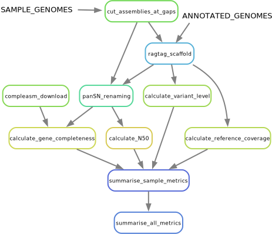

# Assemblies

## Preprocessing scheme

Assemblies that are not Ensembl/RefSeq annotated are cut at gaps back into contigs and then scaffolded against ARS-UCD2.0 to determine chromosome position and orientation.
The assemblies are left at the contig level to avoid an explosion of "N"s in the pangenome graphs.

## Naming scheme

We use a modified version of panSN that seems to be compatible with most downstream tools.
The format is `sample#haplotype#chromosome:start-end`, where the ":start-end" is the extension.
This allows us to track positions of contigs within the reference-scaffolding, making downstream analyses more useful.

## QC

We run several QC steps, like `calN50.js` and `compleasm` to determine metrics intrinsic to the assemblies.
We use a proxy QV by assessing the ratio of InDels to SNPs from the reference-alignment called variants with `paftools.js`.

